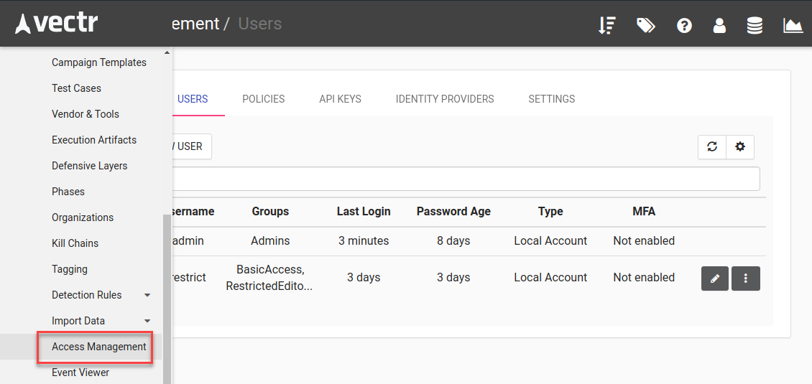

# VECTR Tools
This repository contains sample tools for use with VECTR's API or application integration.

## GraphQL API Sample - CSV Import
The `csv_import_example` directory contains a python project for interacting with VECTR's GraphQL API. It consumes a CSV 
file in the format of a VECTR database CSV export and creates VECTR data based on the CSV contents. 
This can be useful for populating VECTR with Purple Team or Red Team 
activity data after-the-fact or building results from the output of automation tools. With some python knowledge, this program can be modified to 
import data from other log file types like JSON. Pydantic models are powerful and can be used to parse most
 common file formats.

### Steps to run

#### 1. Login and configure your VECTR instance

Login to your VECTR instance with an admin user or a provisioned user with privileges to write to the administration 
section of VECTR and the target database where you will be importing data.  **Due to a current application limitation, 
the user importing data must not have 2-Factor authentication enabled.**

User can be created through Administration -> Access Management
# 


Login with the user who will be acting through the API key.


#### 2. Create an API key

Browse to the user profile.
# 

Create an API key for the user
# 

Record the API key for use in the next step. You will need the Client ID and the Secret, separated by a colon.

#### 3. Create a .env file in the `csv_import_example` directory

Copy the `sample.env` to `.env` and modify the contents. 

`API_KEY` will need to be populated with the API key information from the user you created in Step 2. 
The format is `<CLIENT_ID>:<SECRET>`. Note the colon in the middle between the two key parts.

`VECTR_GQL_URL` will contain the URL to your VECTR installation's GraphQL endpoint. Replace `vectr.internal` with your VECTR hostname and port (if necessary).

`CSV_PATH` points to the relative directory of the CSV you want to import

`TARGET_DB` is the VECTR database where the CSV data will be imported

`ORG_NAME` must match an existing Organization in VECTR. You can create one for your company in VECTR's UI. 

```
API_KEY="PUTYOURAPIKEYHERE"
VECTR_GQL_URL="https://vectr.internal/sra-purpletools-rest/graphql"
CSV_PATH="csv_import_example/sample_data/DEMO_PURPLE_CE.csv"
TARGET_DB="MY_USER_DB"

# This should match the org name in VECTR that you want to use for created content
ORG_NAME="Security Risk Advisors"
```
#### 4. Execute main.py

